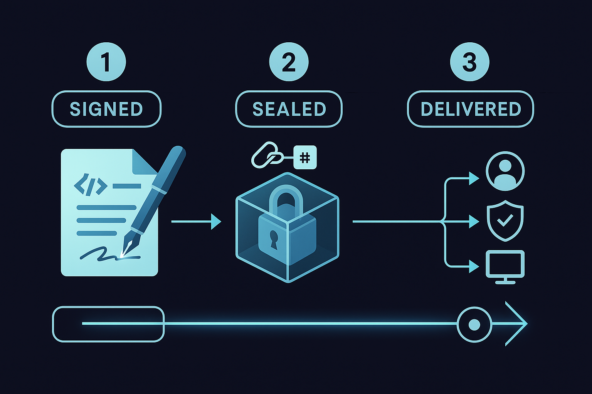

# Lockb0x Protocol

The **Lockb0x Protocol** is an open standard for proving the **existence, integrity, and custodianship** of digital data.  
It’s designed for developers who need **verifiable audit trails** without locking into a single vendor, storage backend, or blockchain.

At its core, Lockb0x provides a portable, signed JSON structure called a **Codex Entry**.  
Each entry links together:

- **Storage Proofs** — showing *where* data is stored (IPFS, S3, Azure Blob, FTP/SFTP, or local storage).  
- **Integrity Proofs** — hashes and checksums that prove the data hasn’t been tampered with.  
- **Signatures** — cryptographic signatures/attestations from the data owner or organization.  
- **Anchors** — blockchain transactions (e.g. Stellar, Ethereum, Avalanche) that provide immutable timestamps.  

By combining these, developers can create **tamper-evident, verifiable chains of custody** for files, records, or datasets.

---
Plain English: Store any kind of data, encrypted or not, on any storage media/platform and use any blockchain. With the lockb0x-protocol and a Codex Entry, you can always prove it hasn't been tampered with, when it was created and by "whom", and who has control or "custody" of the data/asset. If the control ever changes, the protocol follows it. The lockb0x-protocol is not a storage specification. 

It is a solution for data sovereignty that also provides the basis for Controllable Electronic Records, or a CER. 
The lockb0x CER is in compliance with and serves as of machine-readable implementation of a CER as defined under  United States Uniform Commercial Code Sections 12, 9, 8, and 1.

Which was revised in 2022 to address and regulate using blockchain accounts and cryptocurrency in commerce. In addition to defining custody by control as a proof of ownership. I.E., your keys, your tokens; or data/documents/assets as the case may be.

It has been adopted by all 50 states and territoies of the U.S. 

The lockb0x-protocol, by design supports the standards and ethos of GDPR and is an enabler of personal data ownership and 
control. 

The lockb0x-protocol Verifier Reference Implementation is under development. 
Please fork this repo and contribute by submitting a pull-request. 
You can use the Issues tab to ask questions, discuss, or report "issues". 
---

## Why Developers Should Adopt the lockb0x-protocol

- **Cross-Backend Portability**: works the same whether you use IPFS, S3, or a private server.  
- **Standards-Aligned**: builds on RFC 6920 (integrity URIs), RFC 7515 (JOSE signatures), W3C DIDs, and Verifiable Credentials.  
- **Easy Verification**: a simple verifier can check hashes, signatures, and anchors.  
- **Interoperable**: doesn’t replace your storage or blockchain — it ties them together.  
- **Compliance Ready**: supports legal frameworks like GDPR (EU) and UCC Section 12 (US).  

---

## Example Use Cases

- Proving a dataset hasn’t changed between research collaborators.  
- Providing auditors with cryptographically verifiable compliance documents.  
- Anchoring invoices, contracts, or deliverables for cross-organization projects.  
- Creating a digital chain of custody for supply chain or legal evidence.  

---

## Specification

The full technical specification lives in [`spec/v0.0.1-public-draft.md`](spec/v0.0.1-public-draft.md).  
Each section of the spec is broken out into its own file in the `spec/` folder for clarity.  

---

## Contributing

Lockb0x is at an early stage and we welcome feedback, contributions, and discussion.  
- Open issues to suggest improvements or report problems.  
- Submit pull requests to add adapters, verifiers, or clarifications.  
- Join the discussion on standards alignment and compliance use cases.  

---

## License

This project is licensed under the [MIT License](LICENSE), and the Lockb0x Protocol specification and reference implementation are released under the **Apache 2.0 License**.
